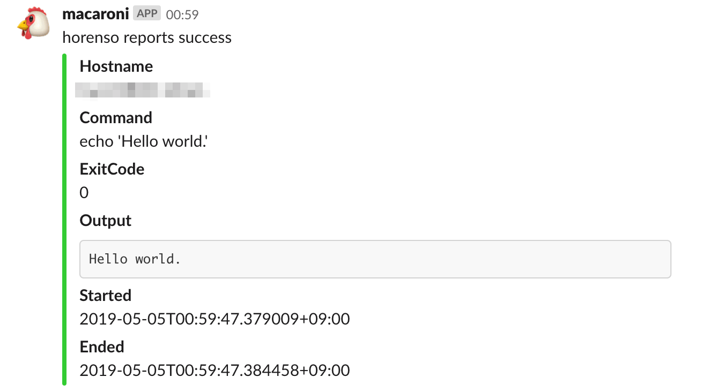

# macaroni

macaroni is a reporter for Songmu/horenso.

macaroni has following functions.

- [Slack](https://slack.com) reporter
  - Post a result of command to Slack.
  - When running in Amazon ECS, reports an information of cluster, task ARN and container name
- [Mackerel](https://mackerel.io) metric reporter.
  - Post service or host metrics
    - error
    - elapsed time

## Usage

```console
$ horenso --reporter=macaroni -- my-batch-command
```

## Installation

### Homebrew

```console
$ brew install fujiwara/tap/macaroni
```

### [ghg](https://github.com/Songmu/ghg)

```console
$ ghg get fujiwara/macaroni
```

Built binaries are available on gihub releases. https://github.com/fujiwara/macaroni/releases

### go get

```console
$ go get github.com/fujiwara/macaroni/cmd/macaroni
```

## Configuration

Environment variables customize behaviors for macaroni.

All of configurations are defined by environment variables.

### Slack reporter

Slack reporter posts a report as a message to Slack.



`SLACK_ENDPOINT`: Incoming Webhook URL. (required)

`SLACK_CHANNEL`: Channel name. (requried)

When `SLACK_ENDPOINT` or `SLACK_CHANNEL` are empty, Slack reporter becomes to disabled.

`SLACK_USERNAME`: Username. (default: webhook name)

`SLACK_MEMTION`: Mentions in a report message. (e.g `@here`)

`SLACK_ICON_EMOJI`: Icon emoji.

`SLACK_PASTEBIN_CMD`: When specified, macaroni invokes the value as command and writes horenso report.Output into that command's stdin. Then report.Output is replaced by the command's output.

`SLACK_MUTE_ON_NORMAL`: Do not report when horenso command exit nomrally.

### Mackerel reporter

Mackerel reporter posts a report as metrics to Mackerel.

Metrics have two values as below.

1. `{prefix}.error.{name}`: When report.ExitCode is non zero, that value becomes to 1, otherwise 0.
1. `{prefix}.elapsed.{name}`: An elapsed time as seconds. (report.EndAt - report.StartAt).

`MACKEREL_TARGET`: A target (Mackerel Host or Service) to post metrics. (required)

- `host:[HostID]` Post a report as host metrics. HostID is optional. When it is not specified (`MACKEREL_TARGTE=host:`), HostID is determined by mackerel-agent config.
- `service:[ServiceName]` Post a report as service metrics. ServiceName is required.

When `MACKEREL_TARGET` is empty, Mackerel reporter becomes to disabled.

`MACKEREL_METRIC_NAME_PREFIX`: A prefix of report metrics. (default: `horenso.report`)

`MACKEREL_METRIC_NAME`: A name of report metrics. (default: `report.Command =~ s/[^0-9a-zA-Z_-]/_/g`).

`MACKEREL_APIKEY`: API key. When the value is not specified, macaroni tries to read API key from mackerel-agent config.

## LICENSE

The MIT License (MIT)

Copyright (c) 2019 FUJIWARA Shunichiro.
